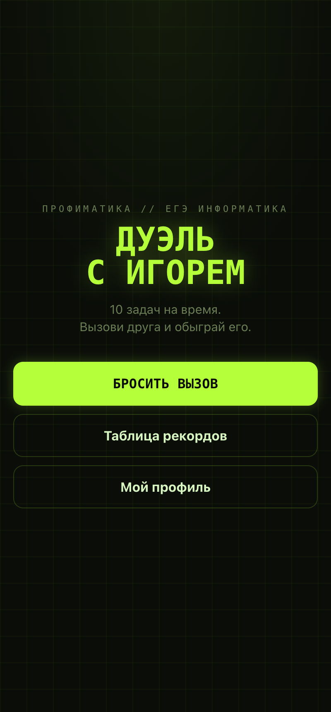
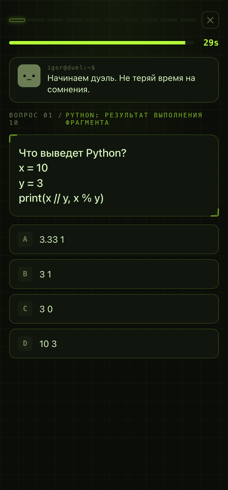
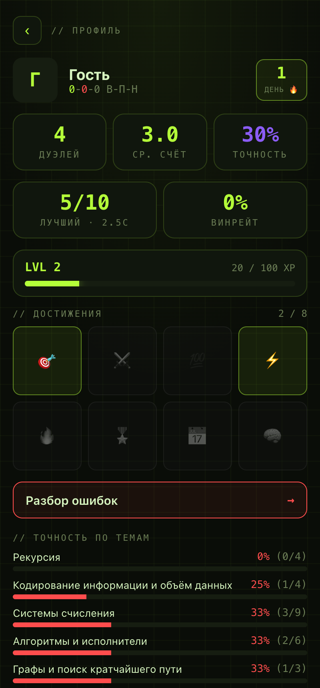
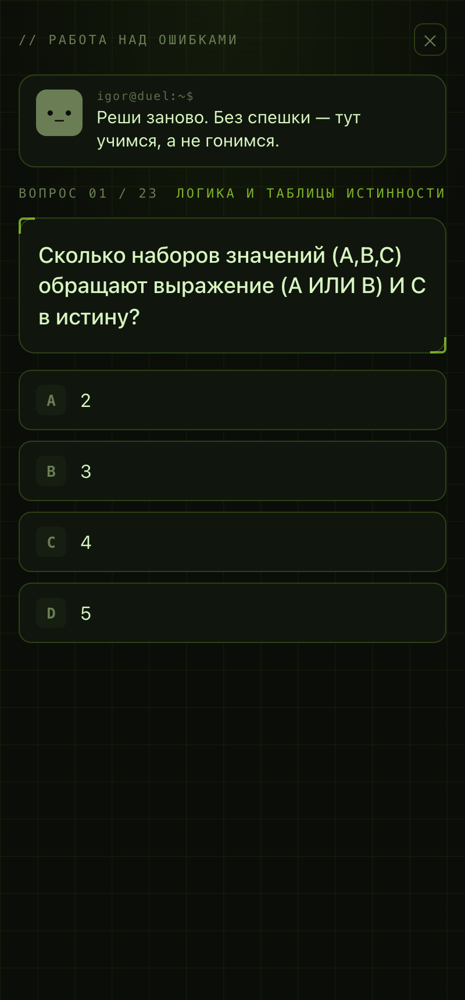

<h1 align="center">⚔️ Дуэль с Игорем</h1>

<p align="center">
  <b>Браузерная PvP-игра по задачам ЕГЭ по информатике.</b><br>
  Решаешь 10 задач на время, делишься вызовом с другом по ссылке, и приложение показывает, кто быстрее и точнее.
</p>

<p align="center">
  <a href="https://denchikper.github.io/duel-with-igor/"></a>
  
  
  
  
  
</p>

<p align="center">
  
  
  
  
</p>

> Сделано за один день на хакатоне Профиматики командой из двух человек. Не концепт, а работающий продукт.

**▶ Живое демо: [denchikper.github.io/duel-with-igor](https://denchikper.github.io/duel-with-igor/)** — открывается прямо в браузере, вызов другу работает по ссылке.

---

## Что это

Тренажёров для ЕГЭ — сотни, но ими не пользуются: решать в одиночку скучно, приложение открывают раз и забывают. «Дуэль с Игорем» превращает подготовку в соревнование с другом. Ты не зубришь — ты хочешь обыграть одноклассника, а подготовка происходит как побочный эффект азарта.

Ведущий и судья — **Игорь Линьков**, преподаватель информатики: комментирует каждый ход, подкалывает за ошибки и объявляет исход дуэли.

## Ключевые возможности

| | |
|---|---|
| 🎯 **Асинхронные PvP-дуэли** | Проходишь забег → делишься ссылкой-вызовом с другом → он решает те же вопросы → повопросный разбор VS |
| 👻 **Призрак соперника** | Во время забега виден прогресс соперника, воспроизведённый по его записанным таймингам — ощущение живого матча |
| 📊 **Аналитика пробелов** | Точность по темам: приложение показывает, где именно ты проваливаешься (рекурсия, системы счисления, …) |
| 🔁 **Работа над ошибками** | Режим прорешивания — заново решаешь именно те задачи, где ошибся, с разбором |
| 🏆 **Уровни, ачивки, стрики** | XP за ответы и победы, 8 достижений, серии дней — игровые механики удержания |
| 📈 **Лидерборд и история** | Таблица рекордов и история твоих дуэлей с разбором каждой |
| 🔊 **Хаптик и звук** | Тактильный и звуковой отклик на ответах (Web Audio, без внешних файлов) |

**Контент:** 100 задач ЕГЭ по 7 темам — системы счисления, логика, кодирование, алгоритмы, Python, графы, рекурсия.

## Технологии

- **Фронтенд:** React 19 + TypeScript + Vite, чистый CSS (терминальная эстетика, адаптивная тёмная тема)
- **Данные:** Supabase (Postgres + автогенерируемый REST через PostgREST), Row-Level Security
- **Тесты:** Vitest (чистая игровая логика покрыта TDD)
- **Деплой:** GitHub Actions → GitHub Pages, статика без серверного кода
- **Происхождение:** изначально — Telegram Mini App; вызов и авторизация переиспользуют платформу там, где она есть, но приложение полностью работает как самостоятельное веб-демо

## Как устроено

Серверного кода нет: клиент ходит в Supabase напрямую по публичному ключу, данные защищены политиками RLS. Дуэль — это запись с зафиксированным набором вопросов; каждый участник пишет свой забег; экран сравнения читает два забега по одному `duel_id`. Вызов передаётся обычной ссылкой с `?duel=<id>`.

Проект писали параллельно, поэтому архитектура строго разделена по зонам с общими контрактами (`src/contracts.ts`) — типы данных и пропсы UI заморожены до старта, чтобы ветки не конфликтовали:

```
src/
├── contracts.ts        // единый контракт: типы данных и пропсы (заморожен)
├── core/               // игровая логика (чистая, покрыта тестами)
│   ├── scoring.ts      //   скоринг и сравнение забегов
│   ├── igor.ts         //   подбор реплик Игоря
│   ├── profile.ts      //   статистика, уровни, ачивки, разбор ошибок
│   ├── useRun.ts       //   движок забега: таймер, события
│   └── api.ts          //   слой доступа к Supabase
├── lib/                // клиенты: supabase, звук, платформа
├── screens/            // экраны и навигация
└── ui/                 // презентационные компоненты (без сетевой логики)
```

Презентационный слой (`ui/`) не знает о сети и не содержит игровой логики — данные приходят пропсами, события уходят колбэками. Это позволяло разрабатывать интерфейс против моков, пока ядро ещё не было готово.

## Запуск локально

```bash
npm install

# .env.local (публичный anon-ключ Supabase)
cp .env.example .env.local

npm run dev      # дев-сервер
npm test         # тесты
npm run build    # прод-сборка в dist/
```

Схема базы — в `supabase/schema.sql`, наполнение вопросами — `supabase/reset.sql`.

## Команда

Собрано за один день командой из двух человек: ядро, архитектура и интерфейс — [@Denchikper](https://github.com/Denchikper); контент (банк из 100 задач и реплики Игоря) — [@mazz1k](https://github.com/mazz1k). Разработка велась с ИИ-ассистентами под общими контрактами.

## Лицензия

[MIT](LICENSE)

---

<p align="center"><sub>Хакатон Профиматики · 2026</sub></p>
